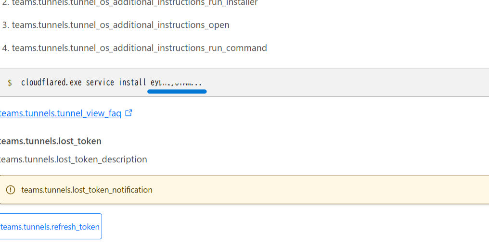
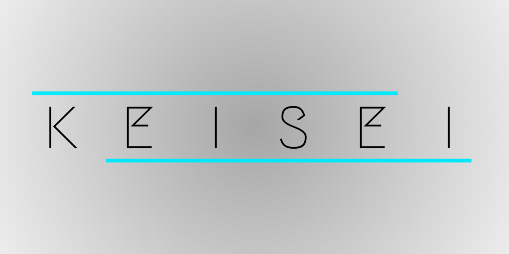

# PiAware Installer
This script automates the installation of PiAware, dump1090-fa, Cloudflared, Prometheus Node Exporter (optional), and UFW firewall (optional) on a Raspberry Pi.

## Purpose
Keisei11.com is Japanese junior-high school students Tech group.
We try to create own ADS-B Network to see Airplanes map.
Therefore we make many ADS-B receiver,and use this script.

## Features
- Installs and configures PiAware and dump1090-fa for ADS-B tracking
- Installs Cloudflared for secure tunneling
- Optionally installs Prometheus Node Exporter for system monitoring
- Optionally configures UFW firewall for security

## Requirements
- Raspberry Pi running a Debian-based OS (Checked Raspberry Pi OS Lite 64bit on RPi Zero 2W)
- Internet connection

## Installation
1. Clone this repository:
   ```sh
   git clone https://github.com/Negishi-Tako/adsb-receiver
   cd adsb-receiver
   ```

2. Make the script executable:
   ```sh
   chmod +x install.sh
   ```

3. Run the script:
   ```sh
   ./install.sh
   ```

4. Enter the Cloudflared Service token
    Please Check CloudFlare(one.dash.cloudflare.com)
    Network > Tunnel > Configure or Create Tunnel
    
    Please watch Japanese Article
    https://note.com/keisei_11/n/n05423aa5c65d
    
## Options
During the installation, you will be prompted to:
- Choose your Raspberry Pi architecture for Cloudflared installation
- Enter a Cloudflared service token
- Install Prometheus Node Exporter (optional)
- Install and configure UFW firewall (optional)

## Disclaimer

Please be aware of the following when using this script:

1. **Legal Responsibility**  
   You are solely responsible for any issues arising from the use of this script. Please ensure that you comply with the laws and regulations applicable in your region or country, and seek legal advice if necessary before use.

2. **Adherence to Terms of Service**  
   This script install with certain services (e.g., PiAware, Cloudflare, etc.). Please make sure to follow the terms of service and policies of these service providers, and avoid any actions that may violate them.

3. **Security and Privacy**  
   We are not responsible for any security or privacy issues that may arise from the use of this script. Please review and ensure that the script aligns with your security and privacy standards before use.

By using this script, you acknowledge and agree to the above conditions.


## License
This project is licensed under the MIT License.

## Author
Created by @negishi_tako at https://Keisei11.com

